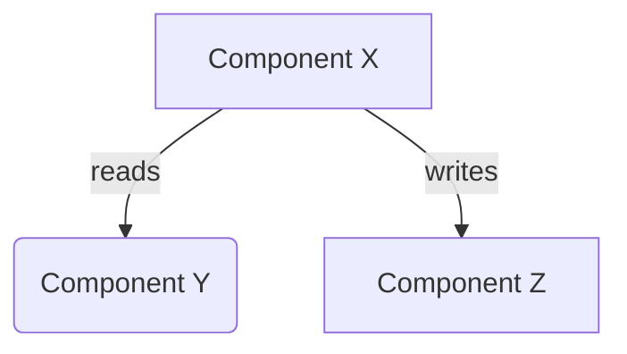
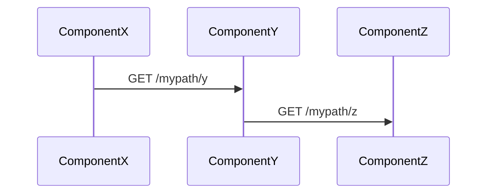

# Architecture

Mermaid diagrams can be helpful in this section, as can images (that link out to their source).

## Component Diagrams

```mermaid
graph TD

  X[Component X] -->|reads| Y(Component Y)
  X -->|writes| Z[Component Z]
```

## Sequence Diagrams

```mermaid
sequenceDiagram
  ComponentX ->> ComponentY: GET /mypath/y
  ComponentY ->> ComponentZ: GET /mypath/z
```
